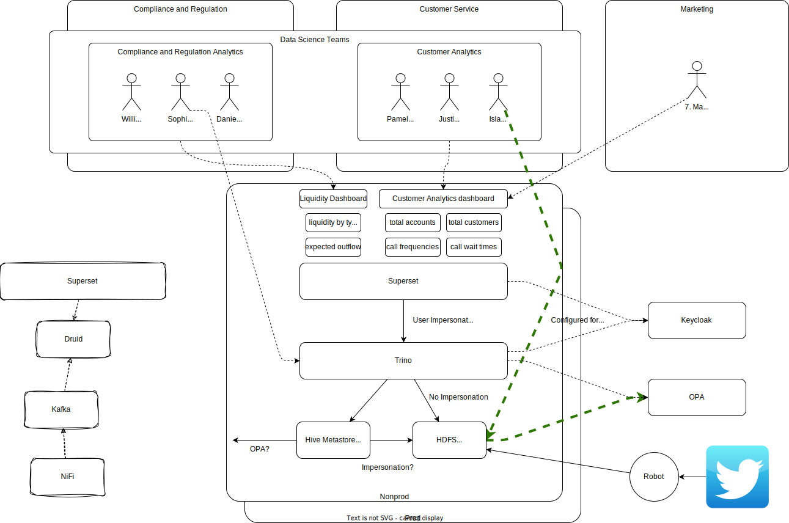

# Knab

Knab is a bank with a number of data science teams covering various aspects of the banks operation and compliance obligations.

Usernames are `$firstname.$lastname`.

## Teams

Two of the data science teams are outlined below:

### Compliance and Regulation Analytics

This team sits under the wider Compliance and Regulation team,and is tasked with making use of the banks customer, credit, securities data and produce internal and regulatory reports to aid in regulatory compliance.

Members of the team:

- William A. Lewis (Team Lead)
- Sophia B. Clarke
- Daniel C. King

### Customer Analytics

This team falls under the Customer Service division and is tasked with making use of the banks data for things like:

- Understanding customer call frequency and wait times
- Trends with the usage of physical branches, internet banking and the banking app

They produce monthly and quarterly reports, but also build dashboards to show live data (eg: call queue, and wait time statistics).

Members of the team:

- Pamela D. Scott (Team Lead)
- Justin E. Martin
- Isla F. Williams (contractor with specific user based permissions)

## Marketing

They need access

Relevant members of the team:

- Mark G. Ketting (needs read access to customer alytics dashboards)

---

